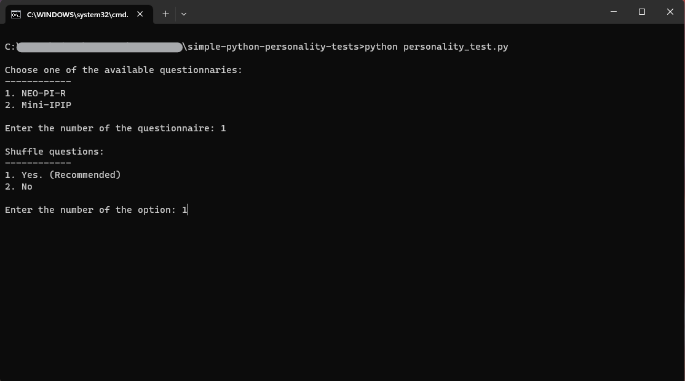
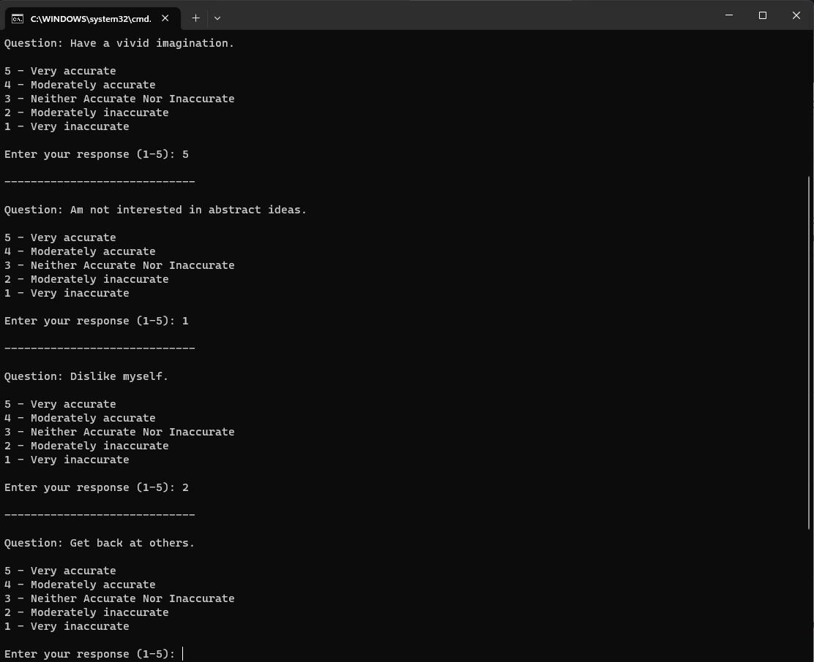
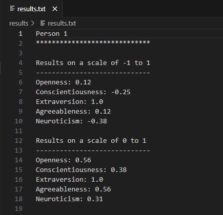

# simple-python-personality-tests
Different IPIP personality questionnaires (Big Five) implemented in python. Very easy to extend with new questionnaires.

Check out this related project that employs the same logic but provides a user-friendly interface for taking the test: https://github.com/PicoAaron/personality-tests

## Choose questionarie:

## Answering questions:

## Results:

